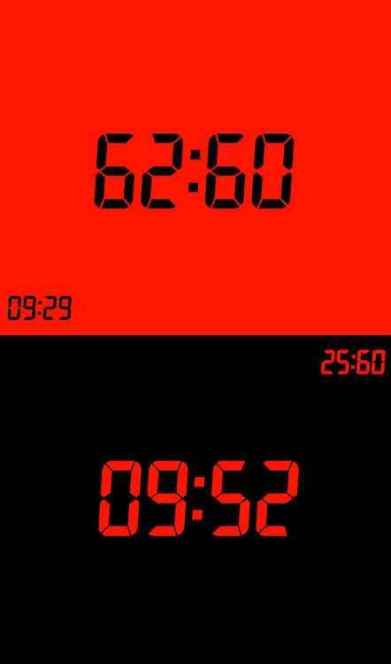

# klaxon ♟️

a chess clock in your pocket, optimized for touchscreen devices and competitive play.

## features
- simple, intuitive interface
- runs in your browser — no setup or installation required
- looks positively sick

## usage
open `index.html` in a web browser and tap anywhere to begin. 
make your move, then punch the clock.

## demo
[try it now in your browser →](https://hunterirving.github.io/klaxon/) 
(touchscreen device recommended)

<i>now with <a href="https://developer.mozilla.org/en-US/docs/Web/Progressive_web_apps/Guides/Installing">Progressive Web App</a> support!</i>

## licenses
- code: [GPLv3](LICENSE)
- [7segment.ttf](https://torinak.com/font/7-segment) font by Jan Bobrowski: [SIL Open Font License](licenses/OFL.txt)